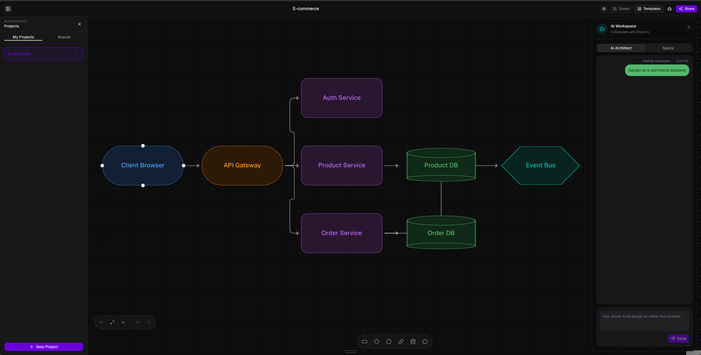
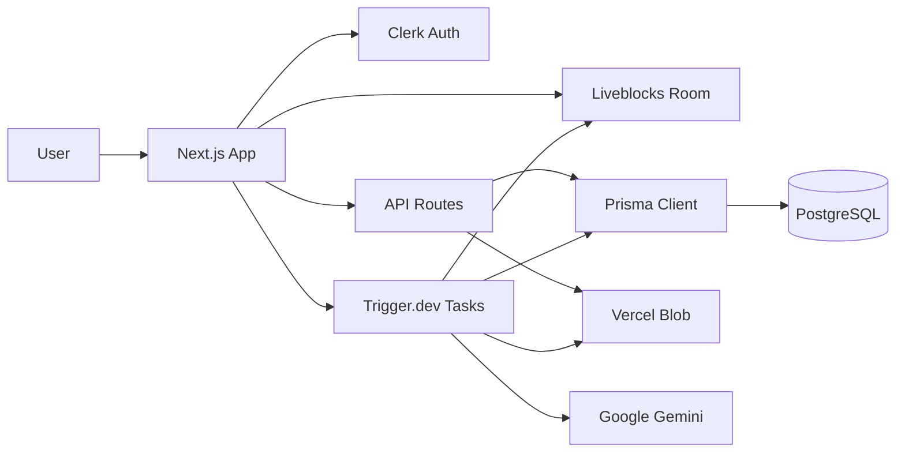

# Ghost AI

Ghost AI is a real-time collaborative system design workspace. Describe a system in plain English, let an AI agent map it onto a shared canvas, refine it with collaborators, and generate a Markdown technical specification from the resulting architecture graph.



[](https://nextjs.org/)
[](https://react.dev/)
[](https://www.typescriptlang.org/)
[](LICENSE)

## Table of Contents

- [About](#about)
- [Features](#features)
- [Tech Stack](#tech-stack)
- [Architecture](#architecture)
- [Project Structure](#project-structure)
- [Getting Started](#getting-started)
- [Configuration](#configuration)
- [Security](#security)
- [How to Contribute](#how-to-contribute)
- [What's Next](#whats-next)
- [License](#license)
- [Acknowledgements](#acknowledgements)
- [Author](#author)

## About

Ghost AI helps teams turn rough system ideas into shared architecture diagrams and technical specs. Users create projects, collaborate on a Liveblocks-powered React Flow canvas, import starter system templates, ask an AI architect to generate or extend designs, and persist generated Markdown specs for review or download.

The app is built as a full-stack Next.js application with authenticated project access, durable Trigger.dev AI workflows, PostgreSQL metadata storage, and Vercel Blob artifact storage.

## Features

| Feature | Description |
| --- | --- |
| Authentication and projects | Clerk-backed sign-in, protected routes, project ownership, and collaborator access. |
| Collaborative canvas | Real-time React Flow canvas with Liveblocks presence, cursors, node editing, edge editing, undo/redo, and autosave. |
| Starter templates | Curated architecture templates that can replace the active canvas with prebuilt system designs. |
| AI architecture generation | Trigger.dev task that uses Gemini to generate validated canvas nodes and edges from a natural language prompt. |
| AI workspace chat | Project-scoped AI Architect sidebar with persisted chat history and collaborative Liveblocks events. |
| Spec generation | Trigger.dev task that converts the current canvas and chat context into a Markdown technical specification. |
| Spec persistence and download | Generated specs are saved to private Vercel Blob storage, listed in the UI, previewed, and downloaded through authenticated routes. |
| Light and dark themes | Token-driven theme system with a dark technical workspace as the default visual language. |

## Tech Stack

| Layer | Technology | Role |
| --- | --- | --- |
| Framework | Next.js 16 + TypeScript | Full-stack app with server and client boundaries. |
| UI | Tailwind CSS + shadcn/ui + Base UI | Component composition, styling, dialogs, tabs, and controls. |
| Auth | Clerk | User identity and route protection. |
| Database | Prisma 7 + PostgreSQL | Project metadata, collaborators, task runs, specs, and AI chat history. |
| Canvas | Liveblocks + React Flow | Real-time collaboration, storage, presence, cursors, nodes, and edges. |
| Background tasks | Trigger.dev | Durable AI design and spec generation workflows. |
| AI | Google Gemini through AI SDK | Structured architecture generation and Markdown spec generation. |
| Artifact storage | Vercel Blob | Canvas snapshots and generated specs. |
| Tooling | Biome + pnpm | Formatting, linting, package management, and verification. |

## Architecture



The app keeps long-running AI work out of request handlers. API routes validate input, enforce Clerk authentication and project membership, trigger background tasks, and persist metadata. Trigger.dev tasks perform AI generation, publish room events, mutate Liveblocks canvas state, and persist generated artifacts.

Metadata lives in PostgreSQL. Large artifacts live in Vercel Blob, with database records storing the artifact URLs. Liveblocks handles real-time canvas state and collaboration inside project-scoped rooms.

## Project Structure

```text
src/app/                  Next.js routes, pages, layouts, and API handlers
src/components/           App UI composition and shadcn/ui wrappers
src/hooks/                Client hooks for canvas autosave and keyboard shortcuts
src/lib/                  Shared infrastructure, auth helpers, Prisma, Liveblocks, and AI utilities
src/trigger/              Trigger.dev background tasks
types/                    Shared canvas and task event types
prisma/                   Prisma schema and migrations
context/                  Product, architecture, UI, workflow, and feature specs
tests/                    Source-level regression tests
```

## Getting Started

### Prerequisites

- Node.js 20 or newer
- pnpm
- PostgreSQL database
- Clerk application
- Liveblocks project
- Trigger.dev project
- Vercel Blob store
- Google Gemini API key

### Install dependencies

```bash
pnpm install
```

### Configure environment

Create `.env.local` and provide the required values listed in [Configuration](#configuration).

### Apply database migrations

```bash
pnpm prisma migrate dev
```

`pnpm install` runs `prisma generate` through the `postinstall` script. Run it manually if you need to regenerate the client after schema changes:

```bash
pnpm prisma generate
```

### Start the Next.js app

```bash
pnpm dev
```

Open [http://localhost:3000](http://localhost:3000) in your browser.

### Start the Trigger.dev worker

In a second terminal, run:

```bash
pnpm exec trigger dev
```

The Trigger config loads `.env.local` before task discovery so local task runs can read Gemini, Liveblocks, Blob, database, and Trigger credentials.

### Verification commands

```bash
pnpm format
pnpm lint
pnpm run build
```

Some focused regression tests can also be run directly with Node's TypeScript stripping support, for example:

```bash
node --experimental-strip-types tests/spec-ui-integration.test.ts
```

## Configuration

Environment files are ignored by git. Keep secrets in `.env.local` for local development.

| Variable | Required | Purpose |
| --- | --- | --- |
| `DATABASE_URL` | Yes | PostgreSQL connection string used by Prisma and the app. |
| `NEXT_PUBLIC_CLERK_PUBLISHABLE_KEY` | Yes | Clerk browser publishable key. |
| `CLERK_SECRET_KEY` | Yes | Clerk server secret key. |
| `NEXT_PUBLIC_CLERK_SIGN_IN_URL` | No | Sign-in route override; defaults to `/sign-in`. |
| `NEXT_PUBLIC_CLERK_SIGN_UP_URL` | No | Sign-up route override; defaults to `/sign-up`. |
| `LIVEBLOCKS_SECRET_KEY` | Yes | Liveblocks server key for issuing room sessions and task-side room updates. |
| `TRIGGER_SECRET_KEY` | Yes | Trigger.dev secret key for local worker authentication. |
| `BLOB_READ_WRITE_TOKEN` | Yes | Vercel Blob token for private canvas and spec artifact storage. |
| `GEMINI_API_KEY` | Yes | Google Gemini API key used by design and spec generation tasks. |
| `DESIGN_AGENT_MODEL` | No | Gemini model for architecture generation; defaults to `gemini-2.5-flash-lite`. |
| `SPEC_GENERATION_MODEL` | No | Gemini model for Markdown spec generation; defaults to `gemini-2.5-flash-lite`. |

## Security

- All protected routes require Clerk authentication.
- Project mutations verify that the current user is the project owner or an authorized collaborator.
- Liveblocks room sessions are issued only after project access checks pass.
- Long-running AI work runs in Trigger.dev tasks rather than API request handlers.
- Canvas snapshots and generated specs are stored in private Vercel Blob storage and accessed through authenticated API routes.
- Environment files and generated secrets are excluded from git.

## How to Contribute

Contributions are welcome.

1. Fork the repository.
2. Create a feature branch from the active development branch.
3. Keep changes scoped to one feature or fix.
4. Follow the project context files in `context/` before changing architecture, storage, UI patterns, or workflow rules.
5. Run `pnpm format`, `pnpm lint`, and `pnpm run build` before opening a pull request.
6. Include a short explanation of the change, verification performed, and any follow-up work.

When adding UI, use existing theme tokens instead of hardcoded colors. When adding server behavior, validate inputs and enforce project access before mutation.

## What's Next

- Run end-to-end browser smoke tests for AI design and spec generation with Trigger.dev, Gemini, Liveblocks, Blob, and the local database connected.
- Add a real product screenshot at `docs/images/ghost-ai-preview.png`.
- Continue improving generated architecture quality, spec quality, and collaborative editing ergonomics.
- Add deeper automated coverage around authenticated project flows and background task outcomes.

## License

Ghost AI is released under the [MIT License](LICENSE).

## Acknowledgements

Ghost AI builds on excellent open-source and developer platforms, including Next.js, React, TypeScript, Tailwind CSS, shadcn/ui, Base UI, Clerk, Liveblocks, React Flow, Prisma, Trigger.dev, Vercel Blob, and the AI SDK.

## Author

Created by Rodrigo Silva.

- Website: [rodgons.com](https://rodgons.com)
